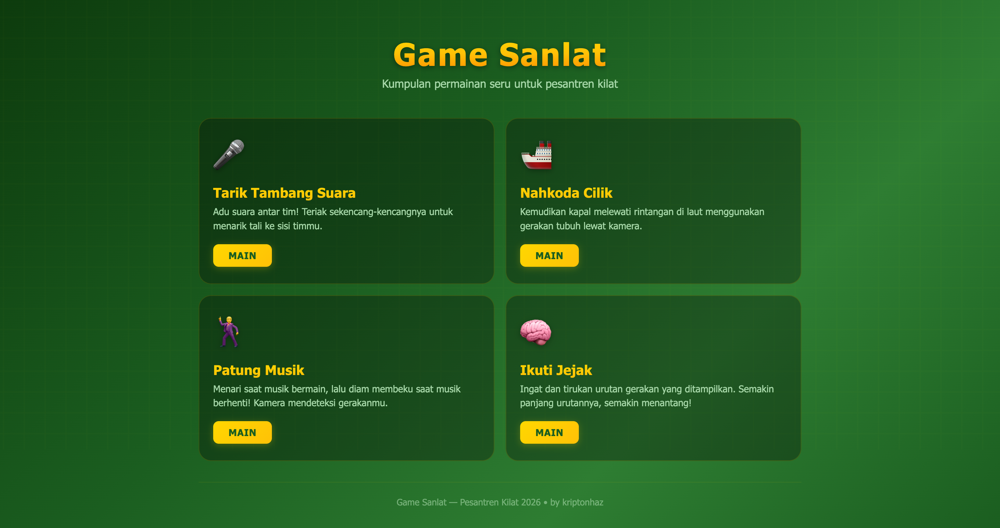
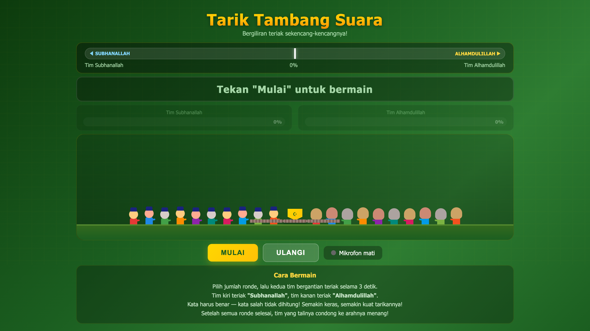
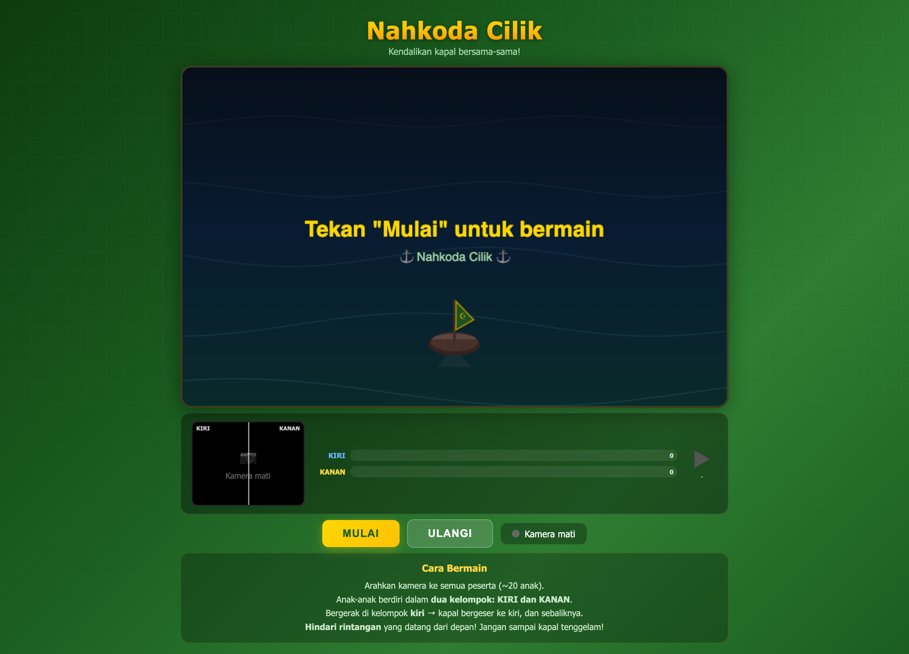
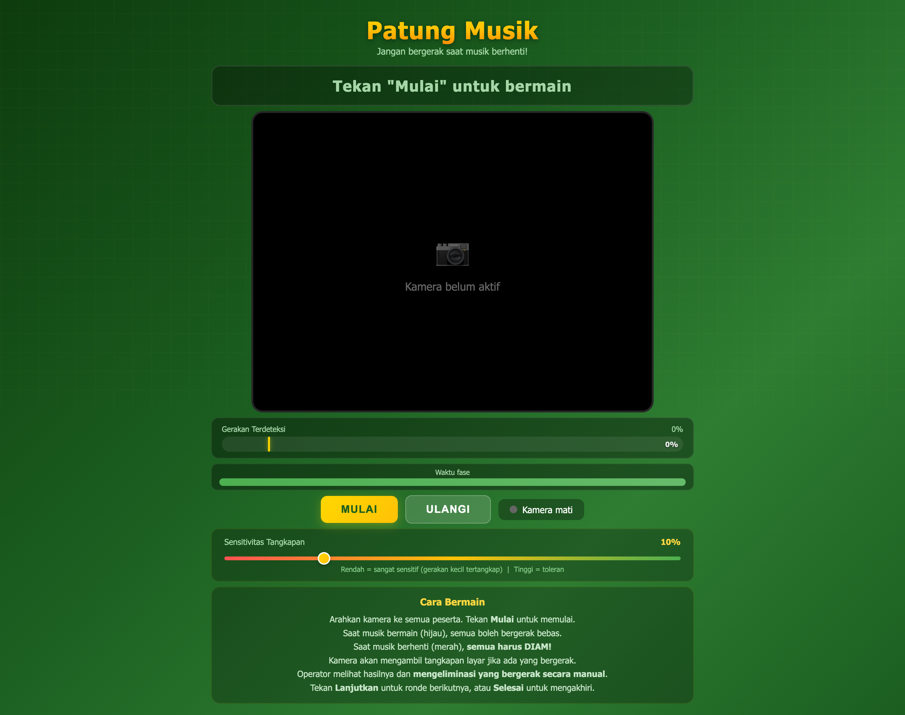
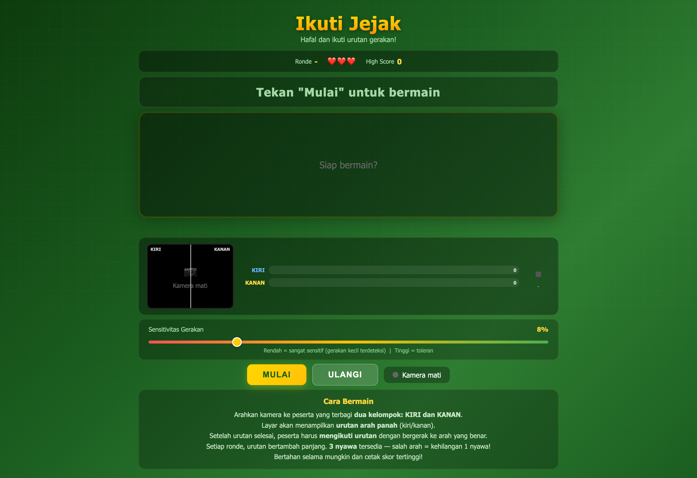

# Game Sanlat

A collection of interactive browser-based games designed for Islamic summer camp (pesantren kilat) activities. No installation needed — just open and play!

**[Play Now](https://sanlat-game.netlify.app/)**



## Games

### Tarik Tambang Suara (Voice Tug of War)

Two teams take turns shouting as loud as they can to pull the rope to their side. Each team must shout the correct Islamic phrase — "Subhanallah" or "Alhamdulillah" — for their volume to count. Uses microphone input and speech recognition.

**Input:** Microphone



---

### Nahkoda Cilik (Little Ship Captain)

Steer a ship through obstacles at sea using body movements detected by the camera. Tilt your body left or right to navigate!

**Input:** Camera



---

### Patung Musik (Musical Statues)

Dance while the music plays, then freeze when it stops! The camera detects your movement — if you move during a freeze, you're out.

**Input:** Camera



---

### Ikuti Jejak (Follow the Pattern)

Memorize and replicate a sequence of movements shown on screen. The sequence gets longer and more challenging with each round.

**Input:** Camera



## Tech Stack

- Vanilla HTML, CSS, and JavaScript (no frameworks)
- Web Audio API & Speech Recognition API
- MediaDevices API / getUserMedia (camera & microphone access)
- Each game is a single self-contained HTML file

## Getting Started

1. Visit [https://sanlat-game.netlify.app](https://sanlat-game.netlify.app/)
2. Pick a game from the landing page
3. Allow camera/microphone access when prompted
4. Play!

Or run locally:

```bash
git clone https://github.com/kriptonhaz/sanlat-game.git
cd sanlat-game
npx serve .
```

> **Note:** You must serve the files over localhost (e.g. `npx serve .` or any local server). Opening the HTML files directly (`file://`) will not work because camera and microphone APIs require a secure context (HTTPS or localhost).

## Project Structure

```
index.html    — Landing page (game selection menu)
tambang.html  — Tarik Tambang Suara (Voice Tug of War)
kapal.html    — Nahkoda Cilik (Little Ship Captain)
patung.html   — Patung Musik (Musical Statues)
ingat.html    — Ikuti Jejak (Follow the Pattern)
```

## License

MIT

---

Made by **kriptonhaz**
